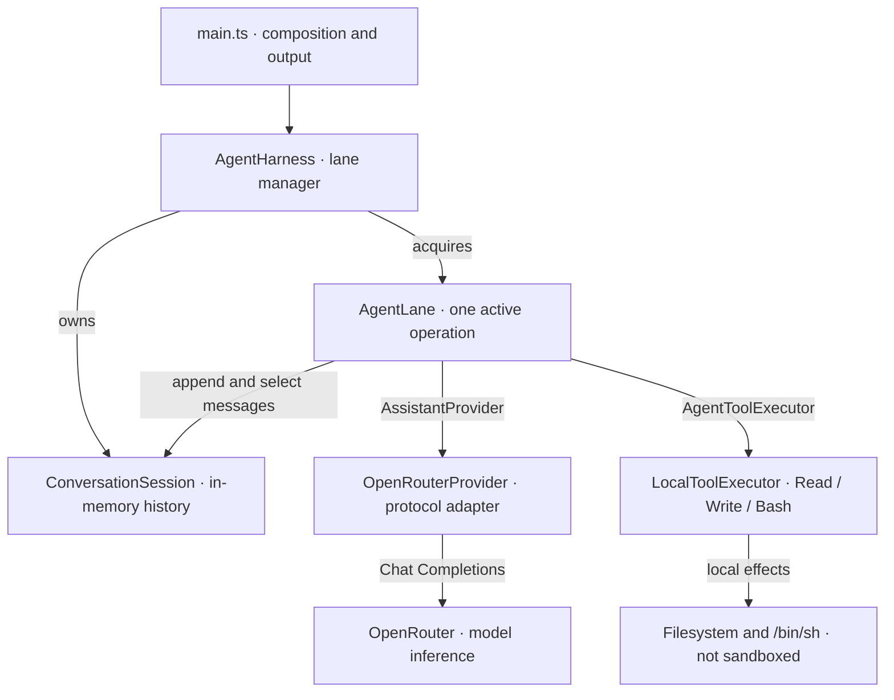
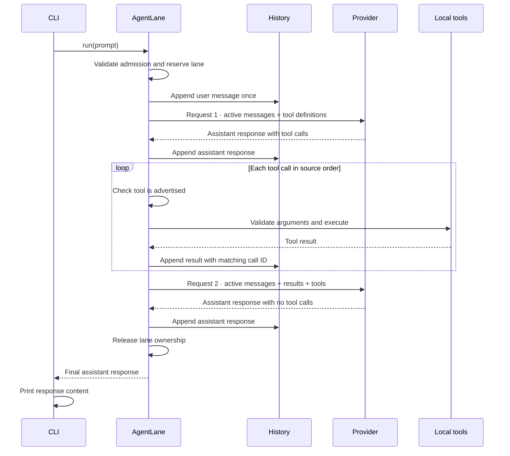

# nano-agent-ts

nano-agent-ts is a TypeScript coding agent that runs on Bun. It sends prompts to a model through OpenRouter, executes `Read`, `Write`, and `Bash` tool calls, and returns the final assistant response.

The project implements the [CodeCrafters “Build Your Own Claude Code” challenge](https://codecrafters.io/challenges/claude-code). It stores conversation history in memory and provides library interfaces for concurrent lanes and conversation branches. It does not provide persistence or sandboxing.

[Quick start](#quick-start) · [Architecture](#architecture) · [Execution guarantees](#execution-guarantees) · [Development](#development) · [Vocabulary](CONTEXT.md)

## Features

- Execute tool calls sequentially and include their results in subsequent model provider requests.
- Limit each turn to a configurable number of model provider requests.
- Run independent lanes concurrently while rejecting overlapping operations on the same lane.
- Branch from shared history and select active messages without deleting earlier transcripts.
- Validate configuration, provider responses, and tool arguments.
- Test orchestration through injected provider and tool-execution interfaces.

The CLI uses one lane, `main`. Concurrent lanes, branching, and session boundaries are available through the library, not through CLI options. The CLI does not start background agent work.

## Quick start

### Before you begin

- [Bun](https://bun.sh/) 1.3 or newer; the challenge buildpack is `bun-1.3`.
- Git and a Unix-like environment with `/bin/sh`, such as macOS, Linux, or WSL.
- An [OpenRouter](https://openrouter.ai/) API key with access to `anthropic/claude-haiku-4.5`. Live requests require network access and may incur charges.

> [!WARNING]
> Tool calls execute without permission prompts or sandboxing. The agent can overwrite files and run arbitrary shell commands with your user's permissions. Commands inherit process environment variables, including credentials, and have no timeout or output limit. The harness sends prompts and tool results to the configured provider, including file contents and command output. Run the agent in an isolated, disposable environment that contains only the files and credentials it needs. Changing the working directory does not restrict access.

### Install and run

```sh
git clone https://github.com/sanurb/nano-agent-ts.git
cd nano-agent-ts
bun install --frozen-lockfile

# Replace the placeholder; never commit a real key.
export OPENROUTER_API_KEY="your-openrouter-api-key"

./your_program.sh -p "Read README.md and summarize the execution guarantees."
```

Each invocation starts a new in-memory session, handles one turn, prints the final assistant content, and exits. The CLI does not support interactive chat or session resume.

```sh
# The development script is an alternative entry point.
bun run dev -p "Read app/main.ts and explain how the harness is configured."

# Create and verify a file in an existing directory.
./your_program.sh -p "Write 'Hello from nano-agent-ts' to hello.txt, then read it back."

# Run a local check and summarize the result.
./your_program.sh -p "Use Bash to run bun run typecheck and summarize the result."
```

The model selects which tools to call. These examples do not guarantee a particular tool sequence.

Paths and commands resolve against the process working directory, not the launcher's directory. To work on another project, change into its directory and run `/path/to/nano-agent-ts/your_program.sh -p "your prompt"`.

### Configuration

| Input | Behavior |
| --- | --- |
| `-p "prompt"` | Required first argument, followed by a nonempty prompt. |
| `OPENROUTER_API_KEY` | Required bearer credential for the configured provider. |
| `OPENROUTER_BASE_URL` | Optional HTTP(S) endpoint; defaults to `https://openrouter.ai/api/v1`. Useful for local test servers or compatible Chat Completions endpoints. |

Only send credentials and conversation data to endpoints you trust; use HTTPS for remote connections. The CLI fixes the model to `anthropic/claude-haiku-4.5` in [app/main.ts](app/main.ts). The default budget is 64 model provider requests per turn, excluding SDK transport retries. Library callers can change it through `maxAssistantSteps` on `AgentLane.run()`; there are no CLI model, tool-selection, or budget flags.

## Architecture

`main.ts` constructs the provider and tool executor and injects them into the lane manager. Each lane receives a branch handle into the same private history store. The diagram shows ownership and calls between modules, not separate processes.



| Module | Responsibility |
| --- | --- |
| [ConversationSession](app/session/conversation-session.ts) | Stores entry identities, parent links, global sequence numbers, and branch tips. History writes complete synchronously, without awaiting provider or tool operations. |
| [AgentLane](app/agent/agent-lane.ts) | Manages admission, the agent loop, result ordering, and captured model/tool configuration. |
| [OpenRouterProvider](app/providers/openrouter-provider.ts) | Handles authentication, OpenAI-protocol translation, and response validation. SDK types remain within this adapter. |
| [LocalToolExecutor](app/tools/local-tool-executor.ts) | Dispatches calls to the three tool modules, which validate arguments and perform local operations. |

The provider and executor do not mutate history or print output. For detailed ownership and failure behavior, see [Agent architecture](docs/architecture.md).

### Request sequence

The following example completes one turn using two model provider requests and one tool batch. A batch can contain several calls. The harness executes them sequentially before making the continuation request. The provider participant represents the adapter and remote inference service.



The loop can finish on the first request or continue until it exhausts the request budget. A response with no tool calls ends the turn, including responses with a length or refusal stop reason. A completed turn does not necessarily mean the task succeeded. The CLI does not print intermediate assistant messages or raw tool results directly.

## Execution guarantees

The following guarantees apply within one process. They do not provide durability or access control.

| Condition | Implemented behavior |
| --- | --- |
| Same-lane overlap or invalid admission | Rejects before accepting the new prompt or changing history. Ownership spans the entire turn, including tool awaits. |
| Tool batch | Records the assistant response before execution, then records each completed result in order. The batch is not atomic. |
| Invalid tool arguments, inactive tool, or tool-execution failure | Stops the batch and model continuation. Earlier results and external effects remain; unresolved calls block new turns and session boundaries. There is no public partial-batch resume API. |
| Provider failure after a completed batch | Keeps the accepted prompt and recorded results; releases ownership without automatically repeating tools. |
| Request-budget exhaustion | Finishes and records the last successful tool batch, then returns `AgentRunLimitExceeded` instead of starting another request. |
| Unexpected provider or executor rejection | Propagates as a defect; `finally` releases active ownership. Unresolved tool calls still block admission. |

Tool-call IDs correlate results with calls within a batch. If the model reuses an ID in a later batch, the harness executes that call again. IDs are not idempotency keys. The harness copies snapshots and provider inputs to prevent callers from mutating retained entries.

The CLI exits `0` when it returns final assistant content. Expected failures produce redacted diagnostics on stderr and exit `1`. This does not redact arbitrary tool output or model-generated answers.

### Tool semantics

| Tool | Effect and outcome |
| --- | --- |
| `Read` | Reads an entire file and returns UTF-8 text. Relative and absolute paths are supported. |
| `Write` | Creates or truncates a file and writes UTF-8 content; parent directories must exist. Writes are not transactional and failures may leave partial contents. |
| `Bash` | Runs `/bin/sh -c`, not Bash, with stdin closed. Captures stdout and stderr together. A nonzero exit or signal becomes a tool result with status so the model can respond; failure to start the shell ends the turn. |

The harness does not provide automatic tool retries, rollback, exactly-once execution, or cross-lane file locking. Lanes have separate conversation state but share access to the environment.

## History, sessions, and vocabulary

Terminology follows [Matt Pocock's AI Coding Dictionary](https://github.com/mattpocock/dictionary-of-ai-coding). A session contains turns, and a turn can contain multiple model provider requests. The model generates output. The harness supplies tools, history, and control flow. The configured model and harness form the agent.

Context is task-relevant information. The context window is the token sequence the model sees on a request. The transcript is retained history, which can include messages excluded from the request. This harness sends active messages and tool definitions. It does not supply a system prompt.

The library can fork a lane at an existing entry and start a new session without deleting earlier history:

- `getSnapshot().transcript` returns the complete branch history; `.context` returns only its active messages.
- `startContextWindow("")` clears accumulated conversation input. Nonempty text initializes the next session with a caller-supplied user message, not a system instruction or verified fact.
- This operation does not generate a summary or implement compaction. There is no token counting or automatic rollover policy.
- Callers manage lanes directly. Lanes are not subagents; there is no delegation tool or automatic result-return mechanism.

Existing API names are retained. `ConversationSession` names the shared history store, and `context_window` records a session boundary, not a model's token capacity. For definitions and mappings, see [CONTEXT.md](CONTEXT.md), the [API terminology map](docs/architecture.md#terminology-and-existing-api-names), and the [history diagram](docs/architecture.md#session-boundaries-clearing-and-handoffs).

### Limitations

All history is in memory and grows without bound. There is no persistence, crash recovery, cross-process ownership, queue, cancellation API, streaming, usage accounting, permission UI, sandbox, compaction, or cross-session memory system. Model-provider transport retries and timeouts use the OpenAI SDK defaults. The request budget limits logical model calls. It does not limit shell runtime, output size, token usage, or total spend.

## Development

```sh
bun install --frozen-lockfile
bun run lint
bun run typecheck
bun run test

# Focus on the agent loop.
bun test app/agent/agent-lane.test.ts
```

Tests do not require a real API key or paid model calls. They use controlled provider/executor implementations, the real OpenAI SDK against local HTTP servers, and temporary files. `fast-check` generates tool batches and history interleavings to test harness invariants. These tests do not evaluate model reasoning quality.

| Coverage | Tests |
| --- | --- |
| Ordered batches, repeated call IDs, partial failures, request budgets | [agent-lane.test.ts](app/agent/agent-lane.test.ts) |
| Concurrent lanes, shared ancestors, copied snapshots, session boundaries | [agent-harness.test.ts](app/agent/agent-harness.test.ts) |
| Global sequence, branch-local projections, identity collisions | [conversation-session.test.ts](app/session/conversation-session.test.ts) |
| Protocol translation and malformed responses | [openrouter-provider.test.ts](app/providers/openrouter-provider.test.ts) |
| CLI output, real file/shell effects, safe expected errors | [main.test.ts](app/main.test.ts) |

TypeScript checks `app/**` and its colocated tests with strict types and no emitted build. Oxlint applies the vendored anti-slop rules. See [package.json](package.json), [tsconfig.json](tsconfig.json), and [.oxlintrc.json](.oxlintrc.json) for the executable configuration.

For challenge submissions, use `codecrafters submit` from your CodeCrafters-linked checkout. [your_program.sh](your_program.sh) is the local launcher; the platform uses [.codecrafters/run.sh](.codecrafters/run.sh) and [codecrafters.yml](codecrafters.yml).

## Documentation and help

- [Agent architecture](docs/architecture.md): module map, lane example, history model, and detailed contracts.
- [Domain vocabulary](CONTEXT.md): dictionary-aligned terms and project-specific concepts.
- [Architectural decisions](docs/adr/) and [Pi/Posthorse research](docs/research/pi-lanes-and-context.md): historical rationale, not dependencies or claims of SDK compatibility.
- [GitHub issues](https://github.com/sanurb/nano-agent-ts/issues): bugs and proposals. Include reproduction steps, your Bun version, and redacted diagnostics—never credentials or private file contents.
- [CodeCrafters](https://codecrafters.io/): challenge instructions and platform support.

## Maintainer and contributions

Maintained by **David Urbano ([@sanurb](https://github.com/sanurb))**, with starter scaffolding from CodeCrafters.

Open an issue before larger changes. For a focused contribution, work on a branch, add or update colocated tests, keep [CONTEXT.md](CONTEXT.md) and the architecture aligned with behavior, and run lint, typecheck, and tests before opening a pull request. There is no separate `CONTRIBUTING.md` yet.

Licensing: no license file or license grant is currently specified. Clarify terms with the maintainer before reuse or redistribution.
