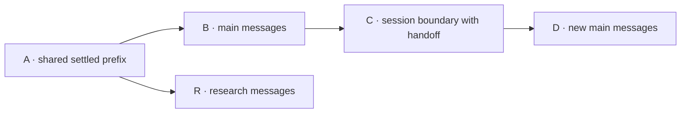

# Agent architecture

This is a small, in-memory coding harness, not a compatible Pi SDK or a durable
agent runtime. Its original class names follow Pi's Session → Branch → AgentLane
separation. [Research and source versions](research/pi-lanes-and-context.md) and
[the decision](adr/0002-explicit-lanes-and-context-windows.md) record that historical
scope; they retain upstream terminology rather than defining today's vocabulary.

## Terminology and existing API names

[CONTEXT.md](../CONTEXT.md) follows [Matt Pocock's AI Coding Dictionary](https://github.com/mattpocock/dictionary-of-ai-coding).
The interaction hierarchy is **session → turn → model provider request**. The
model generates text and tool calls; the harness assembles input, executes tools,
and owns history. The configured combination is the agent.

Existing identifiers are retained for compatibility, not used to redefine the
dictionary's terms:

| Existing name | Meaning in the aligned vocabulary |
| --- | --- |
| `AgentHarness` | Lane manager within the wider harness, which also includes the provider adapter, history store, tools, and CLI composition. |
| `AssistantProvider` / `OpenRouterProvider` | Injected model-provider capability / concrete model-provider adapter. |
| `ConversationSession` | Shared conversation history store; it can retain multiple branches and multiple sessions, not just one bounded interaction. |
| `AgentLane` | Project-specific owner of work on a branch, not a subagent. |
| `AgentLane.run(prompt)` / `AgentRunResult` | Execute one turn / its final answer or failure. |
| `requestAssistant()` / `AssistantRequest` | One model provider request, not a complete tool-using turn. |
| `AssistantResponse` / “assistant step” | One model response, possibly containing tool calls; not necessarily a final answer. |
| `maxAssistantSteps` / `AgentRunLimitExceeded` | Per-turn model provider request budget / budget exhaustion, excluding SDK transport retries. |
| `getContext()` / snapshot `context` | Active messages: only the conversation portion of the next request's context window. |
| `startContextWindow(handoff)` / `context_window` | Start a fresh session on the same branch / record its session boundary. Neither names a model's token capacity. |
| `handoff` argument or field | Caller-supplied handoff text, not the transfer operation itself or a persisted handoff artifact. |

The context window is the model-visible token sequence for each request. This
harness supplies active messages and tool definitions; it currently supplies no
system prompt and does not count tokens or enforce model capacity. Context is the
task-relevant information conveyed, not another name for that message array.
A transcript may retain earlier sessions without sending them to the model.

This is a documentation alignment: runtime behavior, identifiers, protocol roles,
and error strings are unchanged. References below to `run`, `context_window`, or
`ConversationSession` name the existing code, not competing domain definitions.

## Ownership and modules

```text
app/main.ts                              composition, environment variables, rendering, UUIDv7 source
  ├─ cli/cli-configuration.ts             parse arguments and connection settings
  ├─ tools/local-tool-executor.ts         injected Read/Write/Bash dispatch and text results
  ├─ tools/read-tool.ts                   Read advertisement, parsing, and filesystem read
  ├─ tools/write-tool.ts                  Write advertisement, parsing, and create/overwrite
  ├─ tools/bash-tool.ts                   Bash advertisement, parsing, and shell execution
  └─ agent/agent-harness.ts               one private history store; acquire/list named lanes
       ├─ session/conversation-session.ts shared immutable entry tree and branch tips
       └─ agent/agent-lane.ts             active messages, agent loop, operation exclusion
            ├─ AgentToolExecutor         injected tool execution; no history or output ownership
            └─ AssistantProvider         injected model-provider request capability
                 └─ OpenRouterProvider   OpenAI protocol, authentication, response parsing
```

Only `main.ts` has top-level production effects. Library imports neither read the
process environment variables nor start work. Only `providers/openrouter-provider.ts`
imports the OpenAI SDK. `agent/agent-message.ts` owns provider-neutral messages;
tool parameters use JSON Schema, not the SDK's function-tool envelope.

### Conversation history and branches

The lane manager privately owns one `ConversationSession` history store. Entries
have branded IDs, parent IDs, and a globally increasing sequence. Branches share immutable ancestors
and have independent tips. Creating a branch at an existing entry shares that
prefix; it neither copies nor changes the source branch. Creating at an unknown
entry fails. Existing branch/lane acquisition ignores creation-only options.

All history writes finish synchronously, without yielding or invoking providers,
before another JavaScript task can mutate the history store. Entry insertion,
sequence, and tip publication form one in-process mutation step; duplicate ID
generation fails before publication. This is the minimal **history mutation
boundary** (Pi's “session mutation line”), not a storage transaction, cross-process
lock, or durable operation log. Mutable history-store and branch handles never
escape the lane manager's API.

### Harness and lane

`AgentHarness` is a manager, **not the main lane**. Construction creates no lanes.
`lane(name, options?)` acquires one named lane; `lanes()` inventories names without
starting work. Configuration is captured at creation; acquisition never silently
moves a tip or changes tools. Main is acquired explicitly with `lane("main")`.

`AgentLane.requestAssistant(prompt)`:

1. Rejects empty input, same-lane overlap, or unresolved tool calls without writing.
2. Reserves the lane synchronously and appends the accepted user message.
3. Makes one model provider request outside history mutation, with that branch's
   active messages and configured tools.
4. Appends a successful assistant response, then releases request ownership.

Different lanes can await provider calls concurrently. A slow or failed request
on one lane does not hold a global network lock. Expected provider failures retain
the accepted user message and return an error; later input appends after it.
Unexpected provider rejections propagate as defects, with ownership released in
`finally`. No hidden request queue, automatic turn retry, or failure transcript
entry is implied. The SDK retains its own transport retry/timeout defaults.

Responses retain nullable text, normalized stop reasons, and validated tool-call
identities/names/raw argument strings. Tool arguments remain untrusted until the
tool owner parses them. `requestAssistant()` remains a single-request primitive;
if it returns tool calls, those calls remain unresolved.

`AgentLane.run(prompt, options?)` executes one **turn**, owning the **agent loop**:

1. Acquires the lane once and appends the user's prompt once.
2. Makes a model provider request with the active messages and configured tools,
   then records the model response.
3. Returns the response if its tool-call list is empty, regardless of whether the
   wire protocol omitted the list or sent an empty array.
4. Otherwise, executes every call sequentially in source order, checking each
   name against the lane's active tool advertisements before invoking it.
5. Appends each successful result as a provider-neutral `role: "tool"` message
   with its matching `toolCallId`, then makes the next model provider request.

The OpenRouter adapter translates `toolCallId` to `tool_call_id` and reconstructs
assistant `tool_calls` on every request. It receives all active messages,
not just the most recent result. Multiple tool calls in one response are executed
as a batch before one continuation request; there is not one request per tool.
Call IDs are batch-scoped: a later batch may reuse an earlier ID and still
requires a new execution/result.

Turn ownership covers both provider and tool awaits; the snapshot status remains
`requesting` for this whole busy interval. Other lanes remain independent, but
same-lane new work and starting a fresh session are rejected. Pending-tool detection
now matches calls against recorded results. A completed batch no longer blocks
future work; a fork anchored inside an unfinished batch remains blocked even
when its source lane later finishes.

Turns executed through `run()` require an executor supplied at harness
construction. The current `LocalToolExecutor` dispatches Read, Write, and Bash to
their owning tool modules.
It decodes Read bytes as UTF-8 without stripping BOM characters; invalid byte
sequences become replacement characters. Write returns `File written successfully.`
only after the filesystem operation completes. Bash returns the command's combined
output. Neither executor nor provider prints anything or mutates history.

Expected tool failures are **fail-fast**: `run()` returns a safe `ToolExecutionError`,
retains successful prior results, skips remaining calls and model continuation,
and leaves the unresolved batch guarded. Defects propagate with ownership
released. There is no automatic retry/resume of partially executed batches.
A provider failure after a complete batch retains its results without repeating
tools. Tools are not automatically retried, and there is no global deduplication
by provider call ID: another model-requested Write is a new overwrite operation.
A successful write is not rolled back if a later tool or model provider request fails.
Write is not a filesystem transaction: failures may leave partial contents, and
there is no crash-safe/exactly-once guarantee or cross-lane file locking. Separate
lanes isolate conversation state, not concurrent writes to the same path.

`maxAssistantSteps` must be a positive safe integer and defaults to 64 model
provider requests per turn. At the budget boundary the last successful tool batch
is fully recorded before an `AgentRunLimitExceeded` result; no additional request
starts. SDK transport retries do not consume additional units of this logical
request budget. A budget failure is not a final answer.

`getSnapshot()` returns copied configuration, tip, status, complete branch
transcript, and active messages (the `context` field). It is an **in-memory
observation**, not a durable checkpoint. No provider, caller, or sibling lane
receives mutable history entries.

## Two lanes, without a fixed two-worker design

The chosen primitive is **independently scheduled named lanes**. Delegation and
result promotion remain explicit application policy, not hidden framework work.
For example, inside an application function with an already configured `harness`:

```ts
const main = await harness.lane("main");
if (!main.ok) return main;

const research = await harness.lane("research", {
  configuration: { model: "anthropic/claude-haiku-4.5", tools: [] },
});
if (!research.ok) return research;

const [primary, secondary] = await Promise.all([
  main.value.requestAssistant("Propose an in-memory two-lane agent runtime."),
  research.value.requestAssistant("Identify concurrency risks in an in-memory two-lane agent runtime."),
]);
if (!primary.ok) return primary;
if (!secondary.ok) return secondary;
return { ok: true, value: { primary: primary.value, secondary: secondary.value } } as const;
```

Both begin fresh sessions with no conversation messages by default. To share
history and inherit the active messages at an anchor, pass
`createAt: (await main.value.getSnapshot()).tipId` when **creating** research.
The example makes one model provider request per lane; use `lane.run()` on a
harness constructed with an executor for complete tool-using turns. Responses are
not automatically injected into another lane. A name like `research` is not a
security role; the example advertises no tools, but lanes are not subprocesses,
sandboxes, filesystem locks, or authorization boundaries.

A **subagent** would be spawned by the agent through a tool call, work in its own
session, and report back as a tool result. These lanes are caller-managed; no such
delegation tool or return mechanism exists. A future subagent needs an explicit
tool allowlist and result-return policy. No second lane or extra model spend is
enabled by the CLI.

## Session boundaries, clearing, and handoffs

`lane.startContextWindow(handoff)` appends a `context_window` entry representing a
**session boundary**. It starts a fresh session on the same branch without
creating another history store or deleting the preceding transcript. Complete
branch history remains available through `getSnapshot().transcript`; active
messages come only from the latest session boundary onward.



Arrows show history ancestry, **not model requests or delegation**. Each message
box abbreviates a sequence of entries; A and B end with no unresolved tool calls.
Research was forked at A, before main appended B and its boundary C.

| Lane | Retained transcript | Active messages for the next request |
| --- | --- | --- |
| `main` | A → B → C → D | A user message constructed from C's handoff text, then D. A and B are excluded. |
| `research` | A → R | A and R. Main's boundary does not affect this branch. |

The boundary entry C is not itself a protocol message. The history store projects
its handoff text into a user message; tool definitions are supplied separately
by the lane and are not shown in this history diagram. With empty handoff text,
main's active messages would be D alone.

- Empty handoff text performs **clearing**: no prior conversation messages carry
  over. The lane's configured model and tool definitions remain unchanged.
- Nonempty handoff text seeds the new session as a caller-supplied user message,
  not a system prompt or verified fact. It can carry a **handoff** from the prior
  session; the harness does not generate or verify the text.
- This is not built-in **compaction**: no history summary is generated. A caller
  could supply a summary, but that policy lives outside this operation.

Earlier sessions' transcripts and other branches are unchanged. Active messages
otherwise grow only at the tail between model provider requests. Starting a
fresh session is explicit and rejected during active work or an unresolved tool
batch; it makes no model provider request of its own.

The mechanism borrows Posthorse's separation of retained history from model
input, not its runtime. There is no automatic token budget, reminder, overflow
recovery, memory system, persisted notes, history-search tool, or resume. Full
history is retained only for this harness's lifetime, and memory use is unbounded.
Callers must choose bounded handoff text; its size is not automatically checked
against the model's context-window capacity. The agent loop preserves complete
call/result batches on success; automatic session-boundary policy is separate
work.

## CLI compatibility and limits

The CLI creates a history store and acquires `main` with a fresh session, injects
`LocalToolExecutor`, and executes one turn through the agent loop with
`anthropic/claude-haiku-4.5` and Read/Write/Bash advertisements. It prints only the
final first-choice nullable text, with the existing console newline.
Raw file contents and intermediate assistant text are **never printed**. This
intentionally replaces stage MD6's first-tool-only/raw-output behavior.

`tools/read-tool.ts` owns the Read-name check, JSON argument parsing,
nonempty/NUL-free `file_path` validation, filesystem read, and typed failures.
`tools/write-tool.ts` owns Write's exact advertisement, JSON argument parsing,
nonempty/NUL-free `file_path`, required string `content`, and filesystem write.
It parses all arguments before opening the file, creates missing files, and
truncates existing files before writing UTF-8 content without added formatting.
Empty content is valid. Parent directories must already exist; there is no
implicit directory creation.

`tools/bash-tool.ts` owns Bash's advertisement, JSON argument parsing, nonempty/
NUL-free `command` validation, and execution. Each call runs one command through
`/bin/sh -c` in the CLI's working directory, with stdin closed so input-reading
commands fail instead of blocking the turn. Stdout and stderr are captured into a
single result in arrival order; a silent success returns `(no output)`.

A command that ran is a **completed tool call**, not a turn failure: a nonzero exit
or terminating signal appends `Command exited with code <n>` or
`Command terminated by signal <name>` to the output and returns it to the model,
which can then correct itself. Only a failure to start the shell is a
`ToolExecutionError`. Commands inherit the process environment variables and are
neither sandboxed, timed out, nor output-bounded; the model chooses the command, so its
effects are as broad as the invoking user's own shell.

Relative paths resolve against the process working directory; absolute paths
are supported. Filesystem access is not sandboxed. Unadvertised tools, invalid
arguments, read/write failures, shell start failures, model provider failures, and
request-budget exhaustion produce safe stderr diagnostics and exit 1. Successful final responses exit 0.

The lane controls effect ordering through the tool executor interface without
depending on filesystem or process mechanics. Each tool module owns its argument
parser and execution. The dispatcher uses an explicit switch for Read, Write, and
Bash. `LocalToolExecutor` performs both filesystem and shell operations on the
local machine.

Preserved: `-p`, whitespace, ignored trailing arguments, missing key/prompt
messages, OpenRouter default/override, model and tool payload, nullable output.
Malformed protocol responses—including missing/unsupported finish reasons,
invalid or duplicate tool-call IDs, and an empty tool-call batch marked as tool
use—fail safely. Expected errors go to stderr with exit 1. Provider bodies and
credentials are not included in diagnostics; credentials use `RedactedSecret`.

Not implemented: tools other than Read/Write/Bash, persistence, crash recovery,
durable admission, queues, cancellation, hooks/events, streaming, usage accounting,
provider-specific reasoning replay, compaction or autocompact, automatic session
boundaries, memory systems, provider cache affinity, cross-process ownership,
subagents, or Pi session-format compatibility. There is no system prompt,
permission-request UI, or configurable permission mode. Adding persistence
requires serialized, atomic commits of both entries and lane state, together with
recovery tests. Serializing the entry tree alone does not provide recovery.

## Verification

```sh
bun run lint
bun run typecheck
bun run test
```

Tests use controlled implementations of the actual provider capability and the
real SDK against local HTTP servers—no module mocks or paid calls. They cover
same-lane exclusion, both lanes in flight, branch isolation, captured options,
provider failure cleanup, unresolved-tool guards, transcript/active-message separation,
protocol translation, CLI compatibility, and redaction. Read tests cover exact
file contents (including empty, Unicode, CRLF, and large files), relative/absolute
paths, multi-call batches, multi-round README references, final-output-only
rendering, and safe failures. Write tests cover creation, overwrite/truncation,
empty and Unicode contents, exact tool schemas, Write followed by Read in the same
batch, failure without truncation for invalid arguments, and retained writes after
model failure. Generated write tests verify UTF-8 creation/overwrite roundtrips.
Turn tests cover ownership across tool awaits, capability admission, failure
cleanup, partial-batch guards, and request budgets.
Generated turns check complete message prefixes and reused call IDs across batches.
Fast-check also verifies byte preservation for arbitrary file data and generates
interleaved appends and session boundaries on two branches to verify global
sequence, unique IDs, immutable history, and branch-local active messages.

Typechecking includes `app/**` and colocated Bun tests, with strict types,
unchecked-index checking, exact optional properties, and explicit overrides.
The unchanged vendored anti-slop implementation is excluded from lint targets and
the application typecheck; its rules still run against application code. Its
`shared/dictionary-types.ts:201` is incompatible with unchecked-index checking.
All 15 generic anti-slop rules remain errors.

### Diagram maintenance

The Mermaid fences in [README.md](../README.md) and this document are the diagram
sources; GitHub renders them directly. Keep arrows consistent with each diagram's
stated meaning: ownership/effects, temporal message order, or history ancestry.
Do not treat these as interchangeable.

For a terminal preview, copy a fence's contents into a temporary `.mmd` file and
run `merman --file /path/to/diagram.mmd --no-color`. The optional
[merman CLI](https://github.com/kitlangton/merman) supports a Mermaid subset;
inspect GitHub's rendered result as well. It is not a runtime dependency.
