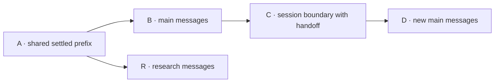

# Architecture

This document describes the state model and internal contracts of nano-agent-ts.
For setup, the module diagram, the request sequence, and CLI behavior, see the
[README](../README.md). [CONTEXT.md](../CONTEXT.md) defines the domain vocabulary.

The design draws on [Pi](https://github.com/earendil-works/pi) for separating
provider access, agent execution, and conversation state, and on
[Claude Code](https://code.claude.com/docs/en/how-claude-code-works) for the
file-and-shell tool loop. This project implements those concepts independently.
It does not depend on either runtime or implement their session formats.

## Composition

[main.ts](../app/main.ts) reads configuration, creates the OpenRouter adapter and
local tool executor, and injects them into `AgentHarness`. It acquires `main`,
calls `run(prompt)`, and renders the result. Library imports do not read process
environment variables or start requests.

[AgentHarness](../app/agent/agent-harness.ts) owns one history store and a map of
named lanes. It creates no lanes until `lane(name, options?)` is called. Acquiring
an existing lane returns the same instance and ignores creation options.

Provider access and tool execution are injected separately so orchestration can
be tested without network or local tool effects. The production adapters and
controlled test implementations use the same interfaces. The lane owns history
updates; neither adapter prints output or changes conversation state.

## Lane lifecycle

[AgentLane](../app/agent/agent-lane.ts) holds a branch handle and captures its model
and tool configuration at creation. Each lane accepts at most one active
operation. Reservation happens before the first await and remains held during
provider requests and tool execution. Other lanes can proceed independently;
there is no global network lock or request queue.

The snapshot status combines active ownership with unresolved tool calls:

| Status | Condition | New turn or session boundary |
| --- | --- | --- |
| `idle` | No active operation and no unresolved tool calls. | Allowed, subject to input validation. |
| `requesting` | A provider request or complete agent turn is active, including tool awaits. | Rejected as `busy`. |
| `awaiting_tools` | No active operation, but recorded calls lack results. | Rejected as `pending_tools`. |

`awaiting_tools` is derived from active messages, not stored as a separate mutable
state. A `finally` block releases active ownership on completion or rejection;
it does not resolve pending calls.

`run(prompt, options?)` executes a turn. It validates admission, the prompt, the
executor, and the request budget before appending the user message. It records
each model response, executes its calls in source order, and records each result
before making a continuation request. At the request limit, it finishes the last
successful tool batch before returning `AgentRunLimitExceeded`.

`requestAssistant(prompt)` makes one model provider request without executing
tools. If its response contains tool calls, they remain unresolved. Use `run()`
for tool-using turns; there is no public API to settle a pending batch manually.

## Provider and tool contracts

[AssistantProvider](../app/agent/assistant-provider.ts) accepts the configured
model, active messages, and tool definitions. It returns a provider-neutral
assistant response or an expected provider error.

[OpenRouterProvider](../app/providers/openrouter-provider.ts) is the only module
that imports the OpenAI SDK. It translates messages to Chat Completions format,
including assistant tool calls and result `tool_call_id` fields. It validates
response roles, nullable content, supported finish reasons, and nonempty,
batch-unique tool-call IDs. Tool arguments remain JSON strings until the owning
tool validates them. Tool definitions use JSON Schema.

The adapter does not retain conversation state. Each request supplies all active
messages and the lane's tool definitions. The harness currently supplies no
system prompt. SDK transport retries do not consume additional units of the
lane's logical request budget.

[AgentToolExecutor](../app/agent/tool-executor.ts) returns result text or a typed
failure. [LocalToolExecutor](../app/tools/local-tool-executor.ts) dispatches to
Read, Write, or Bash. The lane checks the advertised tool name before dispatch;
the tool module validates arguments before performing its effect.

Expected tool failures stop the turn without appending an error result to the
conversation. Earlier results remain recorded, and the failed call remains
unresolved. A shell command's nonzero exit is different: it is a completed tool
execution whose output and status return to the model as a result.

Tool-call IDs correlate calls and results within a batch. They do not deduplicate
calls across batches. A completed effect is not rolled back if a later call or
provider request fails. Unexpected adapter rejections propagate as defects rather
than being converted to expected errors.

## History storage and branching

[ConversationSession](../app/session/conversation-session.ts) stores an
append-only tree of entries. Each entry contains an ID, parent ID, global
sequence number, and either a message or a session boundary. Each branch points
to its current tip.

An append validates a new ID, copies the entry, inserts it, increments the
sequence, and advances the branch tip synchronously. No provider or tool work
runs during this mutation. A duplicate ID fails before insertion or tip changes.
This ordering applies within one JavaScript process, not across processes or
storage transactions.

Creating a lane with `createAt` shares the ancestors of an existing entry. It does
not copy the stored prefix or change the source branch. The new lane inherits
the active messages at that entry, then appends to its own path. If the anchor
contains unresolved tool calls, the new lane is blocked even if the source lane
later completes them: the source's later entries are not on the new branch.

Snapshots copy the branch transcript, active messages, and configuration.
Provider inputs are also copied. Callers cannot use these observations to mutate
the stored entries or lane configuration.

History is retained only for the lifetime of the harness. Reading a transcript
traverses and copies its branch path; selecting active messages traverses and
copies the path back to the latest session boundary. There is no pruning, token
counting, or memory bound. Persistence would require atomic storage of entries
and lane state, plus recovery behavior for interrupted tool effects.

## Session boundaries, clearing, and handoffs

`startContextWindow(handoff)` appends a `context_window` entry on the lane's
branch. This entry marks the start of a new session without deleting earlier
history. The operation is rejected while the lane is active or has unresolved
tool calls.

Arrows show history ancestry, not model requests. Each message box represents a
sequence of entries. A and B end without unresolved tool calls. The research lane
was created at A before main appended B and C.

| Lane | Retained transcript | Active messages |
| --- | --- | --- |
| `main` | A → B → C → D | A user message constructed from C's handoff text, followed by D. |
| `research` | A → R | A and R. Main's boundary does not affect this branch. |

The boundary entry is not a protocol message. The history store converts its
nonempty handoff text into a user message labeled as caller-supplied information.
With empty text, the active messages contain D alone. The lane's model and tool
configuration are unchanged.

This operation makes no model request and generates no summary. Empty text
clears prior conversation input; supplied continuity text can carry a handoff.
Compaction and automatic session boundaries are not implemented. Earlier
transcripts remain accessible to the caller, but there is no history-search tool
that exposes them to the model.

## Terminology and existing API names

Some identifiers predate the vocabulary in [CONTEXT.md](../CONTEXT.md). Their
meanings are:

| Identifier | Meaning |
| --- | --- |
| `AgentHarness` | Lane manager within the complete harness. |
| `ConversationSession` | Shared history store, potentially retaining several branches and sessions. |
| `AgentLane.run()` / `AgentRunResult` | Execution and outcome of one turn. |
| `requestAssistant()` / `AssistantResponse` | One model provider request and its response, not necessarily a completed turn. |
| `maxAssistantSteps` | Maximum logical model provider requests per turn, excluding SDK transport retries. |
| `getContext()` / snapshot `context` | Active conversation messages, excluding tool definitions and other request configuration. |
| `startContextWindow()` / `context_window` | Operation and entry for a session boundary, not a model's token capacity. |

Lanes are caller-managed execution paths, not subagents or security boundaries.
They share local tool access. For tool behavior, access risks, and unsupported
runtime features, see [Tool semantics](../README.md#tool-semantics) and
[Limitations](../README.md#limitations). Test commands and coverage are listed
under [Development](../README.md#development).
